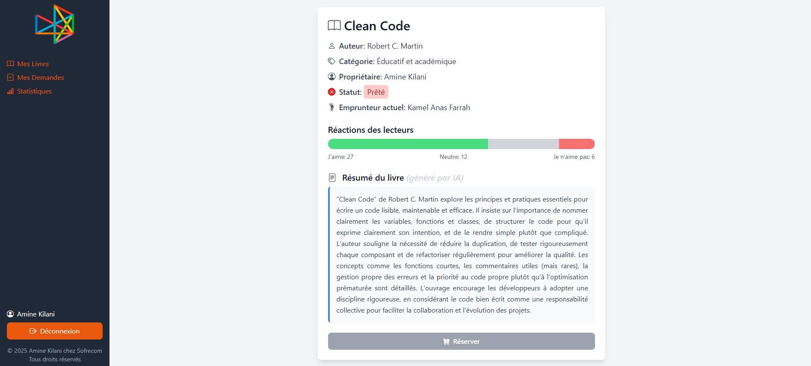

# SofreBooks: Internal Book Sharing Platform

SofreBooks is a simple web application that enables employees to share and borrow books within the organization. The platform allows users to request books, view detailed information, and manage their borrowing history.

## Table of Contents
- [Overview](#overview)
- [Features](#features)
- [Technologies Used](#technologies-used)
- [Installation](#installation)
- [Configuration](#configuration)
- [Running the Application](#running-the-application)
- [Usage](#usage)
- [Screenshots](#screenshots)
- [Contributing](#contributing)
- [License](#license)
- [Contact](#contact)

## Overview
SofreBooks is designed to facilitate book sharing among employees in an organization. Each employee can maintain a personal list of books they own, request books from colleagues, and track their borrowing history. The app features real-time updates for borrowing requests and the ability to manage the book-sharing process smoothly.

## Features
- **Book Search**: Employees can search for books by title or author.
- **Book Details**: Each book has a detailed page with relevant information.
- **Borrowing Requests**: Employees can request to borrow a book if it is not currently on loan.
- **Request Management**: Book owners can accept or decline borrowing requests.
- **Loan History**: Employees can view the history of books they have borrowed or lent.
- **File Export:** Allows users to export a list of books or their borrowing history as an Excel file for easy offline access.

## Technologies Used
- **Frontend**: React.js, Tailwind CSS
- **Backend**: Node.js, Express.js
- **Database**: MongoDB
- **Authentication**: JWT (JSON Web Tokens)
- **AI Integration:** Integrated a DeepSeek API to generate book summaries based on the title and author provided.
- **File Export:** Used the xlsx library to export book lists and borrowing history as Excel files.

## Installation

Follow these steps to get the application up and running on your local machine:

### Prerequisites
- Node.js and npm installed
- MongoDB installed locally or use MongoDB Atlas

### Steps
1. **Clone the repository**:

    ```bash
    git clone https://github.com/amineekilani/sofrebooks.git
    cd sofrebooks
    ```

2. **Install frontend dependencies**:

    ```bash
    cd frontend
    npm install
    ```

3. **Install backend dependencies**:

    ```bash
    cd ../backend
    npm install
    ```

4. **Create `.env` file** in the backend directory and add your environment variables:

    ```env
    PORT=5000
    MONGO_URI=mongodb+srv://<username>:<password>@cluster0.mongodb.net/
    JWT_SECRET=your_jwt_secret
    ```

5. **Run the application** (frontend and backend):

    - Start backend server:

        ```bash
        cd backend
        npm run dev
        ```

    - Start frontend server:

        ```bash
        cd frontend
        npm run dev
        ```

    Now the app will be running at `http://localhost:5173` for the frontend and `http://localhost:5000` for the backend.

## Configuration
Make sure to configure your MongoDB URI and JWT secret in the `.env` file in the backend directory to ensure that the application connects to the database properly.

## Running the Application
Once the application is up and running, you can:
- Use the frontend at `http://localhost:5173` to browse, request, and manage books.
- Use the backend at `http://localhost:5000` to interact with the API.

## Usage
1. After logging in, you can search for books by title or author.
2. Once you find a book you're interested in, you can view its details and request to borrow it.
3. If the book owner accepts your request, you will be notified, and the book will be marked as borrowed.
4. Keep track of your loan history from your profile.

## Screenshots
### Login Page


### Registration Page


### Home Page


### Books Page


### Requests Page


### Statistics Page


### Book Details Page


## Contributing
Contributions are welcome! To contribute:

1. Fork the repository
2. Create a new branch (`git checkout -b feature-name`)
3. Commit your changes (`git commit -m "Add new feature"`)
4. Push to the branch (`git push origin feature-name`)
5. Create a pull request

## License
This project is licensed under the MIT License - see the [LICENSE](LICENSE) file for details.

## Contact
For inquiries, you can reach me at [aminekilani@rades.r-iset.tn](mailto:aminekilani@rades.r-iset.tn).